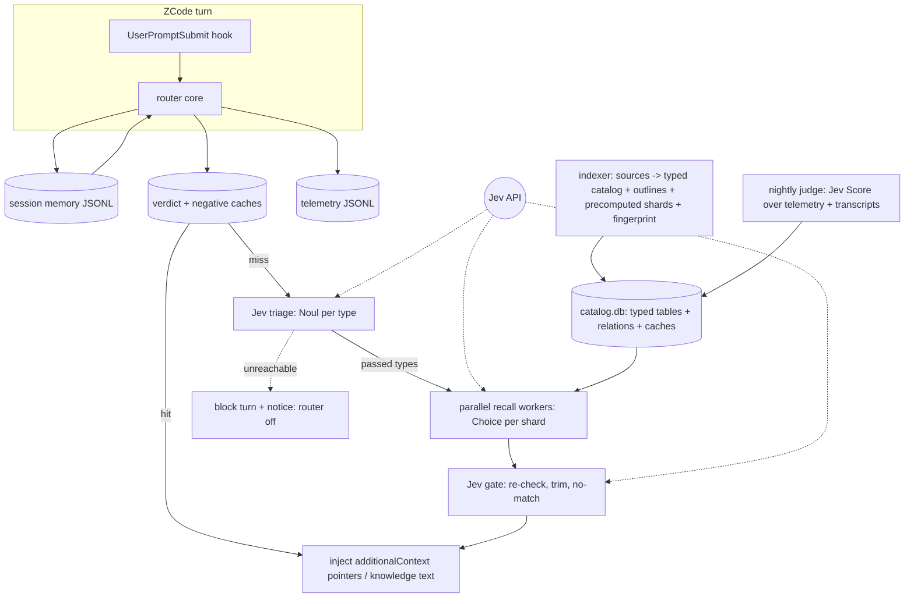

# Routing Layer Above Coding Agents - Plan

## Goal Capsule

- **Objective:** Coding agents receive, at every turn, only the capabilities, knowledge, models, file locations, and rules their current task needs, so agent context stays lean and agent inference stays on the task.
- **Means:** Hook-triggered Python routing layer with parallel Jev workers and a typed SQLite catalog (KTD1, KTD4).
- **Product authority:** Full v1 scope confirmed by owner 2026-09-30 (findings `research/2026-09-30-routing-layer-findings.md`). Nothing deferred inside v1 scope; ZCode is the only v1 harness per owner ruling.
- **Stop conditions:** None open. Research items (shard calibration, relations vocabulary) resolve inside build.

## Product Contract

### Summary

An open-source routing layer above coding agents. A ZCode hook fires every turn; Jev decides what the agent needs; pointers (and knowledge section text) are injected into the turn. Static skill lists and AGENTS.md slim to skeletons. Installable via the Vercel skills method (`npx skills add`). Proven on ZCode in v1; more harnesses follow on success.

### Problem Frame

Today 227 skill directories sit across `~/.zcode/skills` and `~/.agents/skills`, all competing for agent attention via static skill lists. Agents ignore or mis-pick skills, cannot reach vault rules or brain knowledge at all, and burn context on administrative material. The verified vault learning (`2026-06-24-skill-prose-is-not-enforcement`) confirms prose in a SKILL.md enforces nothing; only hooks are true harness gates. Meanwhile Jev returns typed choices at ~0.3s and ~$0.0003/call — fast and cheap enough to run per turn. The routing layer moves capability selection out of agent context and into a Jev-decided hook.

### Key Decisions

- **General routing layer, not a skills router** (session-settled: user-directed — chosen over skills-only tool: offloads all admin/context work). Governs R1.
- **Jev as decision model; code = I/O only** (session-settled: user-directed — chosen over local/hybrid and code prefilter: prefilter offloads decisions). Governs R2, R3.
- **Parallel Jev workers: triage → sharded recall fan → gate** (session-settled: user-directed — chosen over single call and layered trees: full-catalog coverage, Jev-only decisions). Governs R2, R3.
- **Blocking failure until fixed or user override** (session-settled: user-directed — chosen over fail-open: agent blind without routing). Override = notice in agent turn + `router off`/`router on`. Governs R9.
- **Pointer-only injection; knowledge excepted** (session-settled: user-directed — chosen over execution path: loose coupling, speed; knowledge injects section text verbatim). Governs R5, R6.
- **Typed storage: one SQLite file, one table per type + relations table** (session-settled: user-directed — chosen over flat single table). Governs R4.
- **Full capability framework day one: nine types + custom** (session-settled: user-directed). Governs R4.
- **Multi-turn context in v1** (session-settled: user-directed — "did not give permission to defer anything"). Governs R7.
- **All three caches in v1** (session-settled: user-directed). Governs R8.
- **Distribution: Vercel skills method + git auto-push** (session-settled: user-directed — chosen over Syncthing and bespoke installers). Governs R12.
- **Feedback: transcript usage scan + nightly Jev Score judge** (session-settled: user-directed, 17A). Governs R11.
- **Model roster: all models incl. non-harness, with prompt-driven auto-discovery** (session-settled: user-directed). Governs R10.
- **Evals full depth 1-3 with self-improving loop** (session-settled: user-directed). Governs R11.
- **ZCode only in v1** (session-settled: user-directed — "for v1, we will only focus on ZCode"; more harnesses on success). Governs R1.
- **Knowledge = Jev-navigated map, qmd rejected** (session-settled: user-directed — chosen over pointer-only and qmd retrieval: context loss). Governs R6.

### Actors

- A1. Coding agent (ZCode in v1) — consumes injected pointers/knowledge; executes capabilities.
- A2. User — override authority (`router off`/`router on`); roster and sources maintainer.
- A3. Jev API (external) — all routing decisions.
- A4. Indexer — builds typed catalog, dedupes, precomputes payloads.

### Key Flows

- F1. Turn routing
  - **Trigger:** ZCode UserPromptSubmit hook fires with prompt, session id, transcript path.
  - **Actors:** A1, A3
  - **Steps:** Hook passes payload to router core → session memory loaded (rolling summary + active-set) → caches checked (verdict/negative) → Jev triage (Noul per type, one call) → parallel recall workers (Choice over token-budgeted shards of triage-passed types, ~10% overlap) → Jev gate (alignment re-check, trim, dedupe, no-match, confidence) → injection via `additionalContext` stdout → telemetry JSONL + session memory updated.
  - **Outcome:** Agent turn contains pointers (or knowledge section text) Jev selected.
  - **Covers R2, R3, R5, R6, R7, R8.**
- F2. Blocking failure and override
  - **Trigger:** Jev unreachable or past timeout.
  - **Actors:** A1, A2
  - **Steps:** Turn blocks → notice lands in agent turn naming `router off` → user runs `router off` → turns proceed unrouted → `router on` restores.
  - **Outcome:** No silent degradation.
  - **Covers R9.**
- F3. Indexing
  - **Trigger:** Index run (manual CLI or first-run bootstrap).
  - **Actors:** A4
  - **Steps:** Configured sources read (skill dirs, vault rules, AGENTS.md, brain vaults, model roster) → content-hash dedupe (newest wins, aliases kept) → typed tables + relations written → knowledge outlines built → worker payloads precomputed → catalog fingerprint emitted → git auto-push.
  - **Outcome:** Catalog current, deduped, ready to route.
  - **Covers R4, R10, R12.**
- F4. Self-improvement
  - **Trigger:** Nightly judge run.
  - **Actors:** A3
  - **Steps:** Telemetry + transcripts scanned for pointer usage → Jev Score judges outcomes → tuning written to source-side `tuning/` sidecar files (rationale logged) → `router index` applies tuning into the catalog and rebuilds fingerprint + payloads.
  - **Outcome:** Routing quality improves without manual retuning.
  - **Covers R11.**
- F5. Learning capture
  - **Trigger:** Gate output carries a candidate learning (same Jev call, one extra question).
  - **Actors:** A3, A4
  - **Steps:** Candidate appended to `captures/pending.jsonl` → drainer judges each → draft written to matching source tree (or `captures/drafts/` pending review) → `router index` rebuilds catalog + fingerprint → caches invalidate → git sync.
  - **Outcome:** New capabilities, rules, models, and learnings become routable without hand-editing the catalog.
  - **Covers R13.**

### Requirements

**Pipeline and decisions**

- R1. The layer runs on ZCode via its native hook mechanism (`~/.zcode/cli/config.json` events, scripts under `~/.zcode/hooks/`), with a shared core so more harnesses follow on success. Per R1's v1 boundary, only the ZCode adapter ships in v1.
- R2. Every routing decision is Jev's: type triage (Noul per type), recall (parallel Choice workers over token-budgeted shards covering all options of triage-passed types), and gate (final selection, trim, cross-type dedupe, no-match, confidence). Code performs no relevance filtering.
- R3. Worker sharding packs options by state token budget (~2-4k tokens per worker) with ~10% overlap; shard size is calibrated empirically, not assumed.

**Catalog and types**

- R4. Capabilities live in one SQLite file with one table per type — skill, rule, knowledge, model, file_location, plugin, agent, memory, MCP — plus user-defined custom types (auto-created tables) and a relations table (from, to, kind). Core columns per type: id, subtype, name, description, trigger_terms, path, source, version, content_hash, last_verified, enabled, JSON extras. Indexer dedupes by content hash.
- R5. Injection for capability types is pointer-only: `- [type] name — one-line why (path)`.
- R6. Injection for the knowledge type is content: Jev selects sections from a page→section→summary outline and the section text lands verbatim in the turn.

**Failure, memory, caching**

- R7. Multi-turn context: router reads last-K transcript turns, maintains a per-session rolling summary and an active-set of routed capabilities with decay; follow-up prompts resolve via memory; active capabilities are not re-injected.
- R8. Three caches ship in v1: verdict cache (prompt + catalog fingerprint match → replay, zero Jev calls), negative cache (triage-all-no → skip on repeat), and index-time precomputed worker payloads.
- R9. Jev unreachable or slow past timeout → the turn blocks; the notice lands in the agent turn and names `router off`; the command restores unrouted operation until `router on`.

**Sources and roster**

- R10. Sources: 227 local skill dirs, vault rules (`resources/rules/` + AGENTS.md skeleton), brain vaults (read-only), and a model roster covering all models including non-harness ones (Jev, Voyager, subscriptions). The router records models named in prompts but absent from the roster; the roster flag surfaces on the next index run. External source roots are configured, not hardcoded.

**Distribution, sync, evals**

- R11. Evals cover depth 1-3: golden set (hit@1/hit@3 vs ZCode-native skill triggering baseline, majority-of-3 sampling), per-turn telemetry (latency, cost, injection size), and session-trace replay; a nightly Jev Score judge turns outcome logs into descriptor tuning.
- R12. Install via `npx skills add <owner/repo>` (Vercel Agent Skills Directory layout); bootstrap registers ZCode hooks and triggers first index run; the repo (code and accepted captures) syncs across devices by git with automatic push.
- R13. Learning capture: every turn, Jev flags candidate learnings (unknown capability mentioned, rule candidate, absent model, worth-keeping insight) into a pending queue; a capture drainer judges and drafts file additions to the matching source tree (skill stub, rules-file section, roster entry, new-type source dir); accepted drafts reindex and sync. The catalog is always derived from source files — nothing enters the database except through the indexer.

### Acceptance Examples

- AE1. **Covers R2, R5.** Given a prompt naming a pricing task, When the turn starts, Then the agent turn contains a pointer to the pricing skill and no other capability.
- AE2. **Covers R6.** Given a prompt about competitor pricing with a matching brain-vault page, When Jev selects the section, Then the competitor-pricing section text appears verbatim in the turn.
- AE3. **Covers R7.** Given turn 1 routed to a capability and turn 2 says "continue", Then turn 2 resolves through session memory and does not re-inject the active capability.
- AE4. **Covers R8.** Given an identical prompt repeated with an unchanged catalog, Then the second turn routes from cache in under 50ms with zero Jev calls.
- AE5. **Covers R9.** Given the Jev API is unreachable, When a turn fires, Then the turn blocks, the agent turn shows the blocking notice naming `router off`, and after `router off` turns proceed unrouted.
- AE6. **Covers R10.** Given a prompt naming a model absent from the roster, When indexing next runs, Then the roster flags the addition.

### Success Criteria

- Agent-context bytes drop: static skill lists and AGENTS.md reduce to skeletons; routing replaces dumping.
- Routing accuracy meets or beats ZCode-native skill triggering on the golden set (hit@1, majority-of-3, held-out split per KTD10).
- Per-turn added latency under ~1s uncached, under ~50ms cached; cost under ~$0.001/turn.
- Fewer agent steps per task (routing removes capability-hunting turns).

### Scope Boundaries

#### Deferred for later

- Codex, Claude, Kimi adapters — after ZCode success.
- capreg as optional source; marketplace/hosting; productization packaging.

#### Outside this product's identity

- Skill execution by the router (pointer-only, R5).
- Brain writes (router reads and flags; writer systems act).
- Skill authoring/management UI.
- capreg-sized governance build (explicit anti-goal).

### Dependencies / Assumptions

- Jev API contract as verified 2026-09-30: request body is `state`, `model`, `questions` only (confirmed against docs.typesafe.ai quickstart) — no seed/temperature exists, so evals resample N=3 with majority vote.
- ZCode hook layer stays live (verified 2026-09-28/29: 5 events, `additionalContext` injection works).
- Adoption-pipeline decomposition (22 components, 39 interfaces, 5 packages, 14 wave-1 steps) is the build-order authority: `research/adoption-pipeline/`.
- Shared substrate adopted from `projects/agentic-os/jev-implementations/IMPLEMENTATION-PLAN.md`: Jev client shape, threshold policy (`p ≥ 0.95` act, `p ≤ 0.05` skip, else escalate), confidence formula `(n × p_max − 1)/(n − 1)`, JSONL trace format, verified ZCode hook wiring. qmd retrieval and thinker escalation are NOT adopted.

### Sources / Research

- Jev fact sheet: `projects/agentic-os/company-brain/research/llm-wiki-jev/reports/02-jev-typesafe.md`
- Findings and decisions: `research/2026-09-30-routing-layer-findings.md`
- Interface matrix: `research/interface-matrix/2026-09-30-matrix-output.md`
- Adoption pipeline: `research/adoption-pipeline/01-inventory.md` … `07-verification.md`
- Substrate donor: `projects/agentic-os/jev-implementations/IMPLEMENTATION-PLAN.md`
- TypeSafe quickstart (request-body verification, 2026-09-30): https://docs.typesafe.ai/introduction/quickstart.md
- TypeSafe cookbooks: skill suggestion (rank + re-check), hierarchical classification (beam search)

---

## Planning Contract

Product Contract preservation: changed R1 — v1 ZCode-only (owner ruling 2026-09-30, D13). No other product changes; no restructuring.

### Key Technical Decisions

- KTD1. **Runtime: Python 3 stdlib + asyncio.** (session-settled: user-approved — chosen over Bun/TypeScript: zero-dependency OSS story; sqlite3 and asyncio in-box, typesafe-sdk is Python-native.) Governs R2, R3.
- KTD2. **Jev client adopted from jev-implementations `jev.py` shape**: one `ask(state, questions)` fan-out wrapper, typed Noul/Choice/Score answers, JSONL trace (state, questions, answers, usage, latency, cost), threshold policy in code (`p ≥ 0.95` act · `p ≤ 0.05` skip · else escalate), confidence `(n × p_max − 1)/(n − 1)`, retries on 429/529. Governs R2.
- KTD3. **Catalog schema**: one SQLite file; per-type tables share a core column contract (R4 lists it); custom types auto-create tables from the same contract; `relations(from_id, to_id, kind)` exists as schema but is index-only and reserved for post-v1 consumers — no relation-extraction effort in v1 beyond what sources give free (Obsidian links). Governs R4.
- KTD4. **Hook mechanism**: single Python script invoked by ZCode UserPromptSubmit; reads JSON payload from stdin; successful routing prints `additionalContext` JSON to stdout (exit 0); no daemon. **Blocking** = exit code 2 (or `decision: "block"`) with the `router off` notice as the block reason on stderr — `additionalContext` never blocks (requires exit 0). ZCode hook `timeoutMs` is registered ≥ the router's Jev timeout so the harness never kills the hook first. Any routing-layer failure (Jev unreachable, router exception, corrupt state, locked catalog) takes the same block-with-notice path; catalog uses WAL + busy-timeout; corrupt session state rebuilds rather than crashes. Governs R1, R9.
- KTD5. **Override and config**: `router off` / `router on` CLI flips `routing_enabled` in a TOML router config (stdlib `tomllib`); the blocking notice names the exact command; config holds source roots, `capture_mode` (review|auto, default review), Jev settings, timeout, `routing_enabled`. The Jev API key never lives in config or repo — config carries a credential reference (env var name or `op://` path), resolved at startup with process-lifetime caching. Governs R9.
- KTD6. **Session memory**: per-session JSONL file under a router state dir; entries = turn digest + injected set + active-set with turn-count decay; transcript tail (last-K) read from the path in the hook payload. Governs R7.
- KTD7. **Caches**: SQLite tables in the catalog file — `verdict_cache(prompt_fingerprint, catalog_fingerprint, verdict_json, ts)` and `negative_cache(prompt_fingerprint, catalog_fingerprint, ts)`; verdict key = normalized prompt + catalog fingerprint only (session memory excluded from the key — it mutates every turn and would defeat replay; staleness handled at inject time against the active-set). Cache hit-rate is a telemetry field with a target; expected hit regime is cross-session cold-start repeats. Governs R8.
- KTD8. **Knowledge map**: knowledge table stores page→section rows (page, section, heading path, summary line) with the section body text captured in the catalog at index time (plus a source content hash for drift detection) — inject reads from the catalog, never live-file offsets; verbatim, no summarizer. Governs R6.
- KTD9. **Packaging**: the runtime ships self-contained inside the skill directory (`skills/router/` carries package + bootstrap) so `npx skills add` delivers everything it needs; git clone remains the primary install for development, `npx skills add` the discovery/wrapper path. Bootstrap registers the ZCode hook block (with `timeoutMs` per KTD4), runs the first index, snapshots the harness config before editing (prints diff; `router uninstall` restores), and registers a nightly scheduler entry (launchd/cron) invoking the judge then the capture drainer; every `router index` run also drains the capture queue. Catalog and state are per-device and gitignored — each device rebuilds from local sources (repo carries code only); post-commit auto-push covers code. Exact skills.sh manifest spec verified at build against the `npx skills` CLI. Governs R12.
- KTD10. **Evals**: pytest suite; golden set JSONL (prompt, expected capability ids) split into a calibration partition and a held-out partition — the sweep tunes on calibration, the ≥-baseline gate scores held-out only; baseline = ZCode-native triggering elicited and scored by a documented harness on the same prompts; every prompt run 3×, majority vote, variance reported; the gate requires ≥ baseline by a stated margin (default: outside the majority-vote variance). Governs R11.

- KTD11. **Learning capture**: per-turn gate question ("any candidate learning?") appends one line to `captures/pending.jsonl` in the per-device state dir (append-only, batched with the telemetry write, never touches sources mid-turn; append failure logs and continues — routing already succeeded). `router capture` drains — Jev Score judges each candidate (acceptance ≥0.8 drafts, below discards with logged rationale), drafts the file addition, writes via temp-file+rename, skips already-captured content by hash. **Review mode is the shipped default** (`capture_mode = "review"` in config, KTD5 contract); auto mode writes the source tree only on explicit opt-in. **Accepted captures land in a router-owned captured-sources root inside the repo (`sources/captured/<type>/`, one config source root per type)** — git-synced, indexed by the indexer, excluded from harness skill scanning; external trees (vault, `~/.zcode/skills`) stay read-only sources. The catalog is derived-only: no writer inserts rows outside the indexer. Capture-to-routable latency = next drain (nightly, or any `router index` run, which also drains). Governs R13.

### High-Level Technical Design

### Assumptions

- ZCode stays the only harness until owner declares success.
- Golden set seeds at 20-30 prompts (jev-implementations 20-case pattern), grows with replayed traces.
- External source roots (skill dirs, vault, roster) resolved from router config at runtime; nothing hardcoded.
- Latency budget is per-stage with p95 targets: interpreter + I/O overhead ≤150ms, each Jev layer p95 ≤400ms, fan measured at slowest worker; the default Jev timeout derives from measured p95, not the 0.3s mean, and spans retry backoff. Uncached <1s and cached gates are restated per stage in the Verification Contract.
- Per-turn cost basis: ~$0.0003 per Jev call at ~7k state tokens ($0.042/1M input); a per-turn worker ceiling (default 6) keeps cost inside the gate, and the catalog-size crossover to hierarchical (beam) recall is stated when the ceiling binds.

### Sequencing

Walking skeleton first (U1→U5 gives one ZCode turn end-to-end with one type), then memory/caches, then remaining types + knowledge map, then evals/judge, then packaging. Matches adoption-pipeline waves (`research/adoption-pipeline/06-ordering.md`).

---

## Implementation Units

Unit index:

| U-ID | Title | Key files | Depends |
|---|---|---|---|
| U1 | Scaffold + config + catalog schema | `pyproject.toml`, `src/router/config.py`, `src/router/catalog.py` | — |
| U2 | Indexer | `src/router/indexer.py`, `src/router/sources/` | U1 |
| U3 | Jev client, thresholds, trace | `src/router/jev.py`, `src/router/thresholds.py` | U1 |
| U4 | Triage, shards, fan, gate | `src/router/pipeline.py` | U2, U3 |
| U5 | ZCode hook adapter + blocking + `router off` | `src/router/hook.py`, `src/router/cli.py` | U4 |
| U6 | Session memory + active-set | `src/router/memory.py` | U5 |
| U7 | Verdict + negative caches | `src/router/caches.py` | U4, U6 |
| U8 | Knowledge map + section inject | `src/router/knowledge.py` | U2, U4 |
| U9 | Roster, rules, AGENTS.md, remaining types | `src/router/sources/` | U2 |
| U10 | Golden set + telemetry + baseline + sweep | `tests/golden/`, `src/router/evals.py` | U5 |
| U11 | Nightly judge + tuning | `src/router/judge.py` | U10 |
| U12 | Packaging + bootstrap + auto-push | `skills/router/`, `scripts/` | U5 |
| U13 | Context slim-down, ZCode-scoped | `docs/slim-down.md`, `src/router/cli.py` | U5 |
| U14 | Per-turn learning capture | `src/router/capture.py` | U4 |
| U15 | Capture drainer | `src/router/drainer.py`, `src/router/cli.py` | U14, U2 |

### U1. Scaffold, config, catalog schema

- **Goal:** Repo skeleton, router config loader, typed-catalog schema.
- **Requirements:** R4.
- **Dependencies:** —.
- **Files:** `pyproject.toml`, `src/router/__init__.py`, `src/router/config.py`, `src/router/catalog.py`, `tests/test_catalog.py`.
- **Approach:** stdlib-only package; config = YAML (source roots, Jev settings, timeout, `routing_enabled`); catalog module creates per-type tables from the R4 core-column contract, `relations` table, custom-type auto-create; migration = recreate (fingerprint-keyed).
- **Test scenarios:** schema creates all nine type tables + relations; custom type auto-creates with core contract; config round-trips; missing config errors cleanly.
- **Verification:** `pytest tests/test_catalog.py` green.

### U2. Indexer

- **Goal:** Sources → deduped typed catalog with fingerprint and precomputed shards.
- **Requirements:** R4, R10 (source plumbing), R8 (precompute).
- **Dependencies:** U1.
- **Files:** `src/router/indexer.py`, `src/router/sources/skills.py`, `src/router/sources/rules.py`, `src/router/sources/knowledge.py`, `src/router/sources/roster.py`, `tests/test_indexer.py`.
- **Approach:** per-source adapters parse SKILL.md frontmatter / rule frontmatter / wiki headings / roster markdown into core rows; content-hash dedupe (newest wins, alias kept disabled); token-budget shard packing persisted as ready-to-send payloads; SHA-256 catalog fingerprint; CLI entry `router index`.
- **Test scenarios:** skill dir with dupes merges to newest + alias row; fingerprint changes on source edit; shards respect 2-4k token budget with ~10% overlap; custom-type source indexes without code change.
- **Verification:** `router index` over `~/.zcode/skills` yields ~125 rows; `pytest tests/test_indexer.py` green.

### U3. Jev client, threshold policy, trace

- **Goal:** One-call Jev access with thresholds and trace, adopted from jev-implementations.
- **Requirements:** R2.
- **Dependencies:** U1.
- **Files:** `src/router/jev.py`, `src/router/thresholds.py`, `tests/test_jev.py`.
- **Approach:** per KTD2 — fan-out wrapper over `typesafe-sdk` (or raw POST with retry on 429/529), typed answers, JSONL trace, threshold policy, confidence formula; no seed exists (verified) so gates expose `resample(n)` helper.
- **Test scenarios:** mock API returns typed Noul/Choice/Score and trace logs usage+latency; 429 retries then succeeds; timeout raises typed error consumed by U5 blocking path; confidence formula matches `(n × p_max − 1)/(n − 1)`.
- **Verification:** `pytest tests/test_jev.py` green; one real API smoke call logged.

### U4. Triage, shards, recall fan, gate

- **Goal:** The three Jev layers of the turn pipeline.
- **Requirements:** R2, R3.
- **Dependencies:** U2, U3.
- **Files:** `src/router/pipeline.py`, `tests/test_pipeline.py`.
- **Approach:** per KTD2/KTD4 — triage = one call, Noul per type; fan = asyncio gather over precomputed shards of triage-passed types; gate = one call re-checking winners; no-match outcome when nothing clears threshold; every relevance decision in Jev.
- **Test scenarios:** triage passing one type fires only that type's shards; fan returns winners + probabilities; gate trims cross-type duplicates; no-match prompt returns empty injection; 255+ option type shards into multiple workers covering all options.
- **Verification:** `pytest tests/test_pipeline.py` green; mock-Jev end-to-end returns pointer line.

### U5. ZCode hook adapter, injection, blocking, override

- **Goal:** Live ZCode turns receive injections; failure blocks; `router off` works.
- **Requirements:** R1, R5, R9.
- **Dependencies:** U4.
- **Files:** `src/router/hook.py`, `src/router/cli.py`, `tests/test_hook.py`.
- **Approach:** per KTD4/KTD5 — stdin JSON payload, stdout `additionalContext`; pointer format per R5; Jev failure or timeout → block with notice naming `router off`; CLI flips `routing_enabled` in config; adopted ZCode hook registration from jev-implementations Phase 4 evidence.
- **Test scenarios:** payload → additionalContext JSON with pointer line, exit 0 (Covers AE1); Jev timeout → exit 2 block with `router off` reason on stderr, no additionalContext (Covers AE5); live spike: verify the blocked-notice renders to the user on a real blocked prompt before U6+ build on it; `router off` then turn proceeds unrouted; `router on` restores (Covers AE5); malformed payload → block-with-notice, fail-closed consistent with R9; router exception → block-with-notice, not a crash.
- **Verification:** live ZCode session shows injected pointer mid-turn.

### U6. Session memory, active-set

- **Goal:** Follow-up turns resolve via memory; no duplicate injection.
- **Requirements:** R7.
- **Dependencies:** U5.
- **Files:** `src/router/memory.py`, `tests/test_memory.py`.
- **Approach:** per KTD6 — JSONL session file, turn digests, active-set with decay; transcript tail from payload path feeds state alongside memory; memory digest joins the cache fingerprint.
- **Test scenarios:** "continue" turn resolves active capability without re-injection (Covers AE3); decayed capability re-injectable; memory file absent → cold start clean; concurrent sessions keep separate files.
- **Verification:** `pytest tests/test_memory.py` green.

### U7. Verdict + negative caches

- **Goal:** Repeat prompts skip Jev entirely.
- **Requirements:** R8.
- **Dependencies:** U4.
- **Files:** `src/router/caches.py`, `tests/test_caches.py`.
- **Approach:** per KTD7 — fingerprint-keyed SQLite tables; verdict replay returns stored injection; negative entries skip pipeline; catalog fingerprint mismatch invalidates both.
- **Test scenarios:** identical prompt + unchanged catalog → replay <50ms, zero Jev calls (Covers AE4); reindex invalidates; near-identical prompt treated as miss (conservative) until tuned.
- **Verification:** `pytest tests/test_caches.py` green; timing assertion on replay path.

### U8. Knowledge map, section injection

- **Goal:** Knowledge arrives as verbatim section text.
- **Requirements:** R6.
- **Dependencies:** U2, U4.
- **Files:** `src/router/knowledge.py`, `tests/test_knowledge.py`.
- **Approach:** per KTD8 — outline rows from heading scan; Jev picks sections via gate; inject reads body verbatim; no qmd, no summarizer.
- **Test scenarios:** matching page + prompt → section text verbatim in injection (Covers AE2); heading-less page handled; section selection honors token budget.
- **Verification:** `pytest tests/test_knowledge.py` green.

### U9. Roster, rules, AGENTS.md, remaining types

- **Goal:** All nine types + roster auto-discovery live.
- **Requirements:** R4, R10.
- **Dependencies:** U2.
- **Files:** `src/router/sources/plugins.py`, `src/router/sources/agents.py`, `src/router/sources/memories.py`, `src/router/sources/mcp.py`, `src/router/discovery.py`, `tests/test_sources_types.py` (roster/rules adapters extend in place from U2).
- **Approach:** roster = owner-maintained markdown (all models incl. Jev, Voyager, subscriptions); discovery scans session transcripts at index time for models named but absent from the roster and records the flag (Covers AE6); rules + AGENTS.md sections typed as rule rows; plugin/agent/memory/MCP sources from configured roots; custom types are schema-only until a source is configured.
- **Test scenarios:** unknown model in prompt → roster flag on next index (Covers AE6); AGENTS.md section becomes rule rows; custom type end-to-end.
- **Verification:** `router index` populates all type tables from configured sources.

### U10. Golden set, telemetry, baseline, calibration

- **Goal:** Routing accuracy measured against ZCode-native triggering; shard sizing tuned.
- **Requirements:** R11, R3.
- **Dependencies:** U5.
- **Files:** `src/router/evals.py`, `tests/golden/golden.jsonl`, `tests/test_evals.py`.
- **Approach:** per KTD10 — 20-30 seed prompts with expected capability ids; each prompt 3×, majority vote, variance reported; baseline = ZCode-native triggering on same prompts; telemetry already logged per turn; sweep iterates shard budget × options-per-shard and reports hit@1.
- **Test scenarios:** runner scores hit@1/hit@3 vs expected; baseline runner produces comparable scores; sweep output names winning budget; replay of a logged session reproduces its verdicts.
- **Verification:** eval report exists with router-vs-baseline row; router ≥ baseline on hit@1.

### U11. Nightly judge, descriptor tuning

- **Goal:** Self-improvement loop closes.
- **Requirements:** R11.
- **Dependencies:** U10.
- **Files:** `src/router/judge.py`, `tests/test_judge.py`.
- **Approach:** scan telemetry + transcripts for pointer usage; Jev Score judges each routed turn; tuning written to source-side `tuning/` sidecar files with rationale — the indexer merges them into the catalog (derived-only invariant holds: recreate migration never loses tuning); the judge's final step invokes `router index`; log every change.
- **Test scenarios:** used-pointer turns score higher than ignored ones; judge writes a tuning with rationale; no-telemetry night is a no-op.
- **Verification:** one judge run over real week-one logs writes ≥1 documented tuning.

### U12. Packaging, bootstrap, auto-push

- **Goal:** `npx skills add` installs; hooks self-register; repo auto-pushes.
- **Requirements:** R12.
- **Dependencies:** U5.
- **Files:** `skills/router/SKILL.md`, `scripts/bootstrap.py`, `scripts/install-hooks-zcode.py`, `.git/hooks/post-commit`, `tests/test_packaging.py`.
- **Approach:** per KTD9 — Vercel skills layout with wrapper skill; bootstrap registers ZCode hook block and runs first index; post-commit auto-push; skills.sh manifest spec verified against `npx skills` CLI at build time.
- **Execution note:** mostly packaging/config — prefer install/runtime smoke verification over unit coverage.
- **Test scenarios:** bootstrap on clean clone registers hook + builds catalog; post-commit pushes when remote set; no remote → clean no-op.
- **Verification:** second-machine clone + `npx skills add` + bootstrap → routed turn works.

### U13. Context slim-down, ZCode-scoped

- **Goal:** Byte-drop success criterion delivered: static skill list and ZCode-scoped instruction surfaces become skeletons; routing replaces dumping.
- **Requirements:** Success Criteria (agent-context bytes drop), R1 (ZCode-only boundary).
- **Dependencies:** U5.
- **Files:** `docs/slim-down.md` (runbook), `src/router/cli.py` (`router slim` dry-run + apply).
- **Approach:** enumerate ZCode-scoped surfaces only — `~/.zcode/skills` static list usage, ZCode-scoped instruction files; shared/vault-level AGENTS.md files explicitly out of scope until multi-harness adapters exist (other agents still read them). Dry-run prints before/after byte counts; apply writes skeletons and records originals for restore.
- **Execution note:** verification is a live-session smoke, not unit coverage.
- **Test scenarios:** dry-run reports counts without changing files; apply reduces ZCode-scoped surfaces; restore returns originals; shared AGENTS.md untouched.
- **Verification:** real ZCode session runs with skeleton surfaces; routing supplies capabilities.

### U14. Per-turn learning capture

- **Goal:** Turn-level learnings and capability mentions queued, not lost.
- **Requirements:** R13.
- **Dependencies:** U4.
- **Files:** `src/router/capture.py`, `tests/test_capture.py`.
- **Approach:** per KTD11 — one extra gate question; candidates appended to `captures/pending.jsonl`; zero mid-turn source writes; queue entry carries turn context for the drainer.
- **Test scenarios:** unknown skill mentioned → queue entry with context; rule-shaped instruction ("always X") → candidate typed `rule`; no candidates → no queue write; queue append fails → log-and-continue (routing already succeeded; line recovered next drain), turn NOT blocked.
- **Verification:** `pytest tests/test_capture.py` green; live turn mentioning a new tool produces a queue entry.

### U15. Capture drainer

- **Goal:** Queued learnings become routable capabilities/rules/roster entries.
- **Requirements:** R13.
- **Dependencies:** U14, U2.
- **Files:** `src/router/drainer.py`, `src/router/cli.py` (`router capture`), `tests/test_drainer.py`.
- **Approach:** per KTD11 — Jev Score judges each pending capture; drafts written to `captures/drafts/` (review mode) or source tree (auto mode, per config); every apply runs `router index`; new type = new source dir + auto-table via indexer.
- **Test scenarios:** skill-shaped capture → SKILL.md stub drafted; rule capture → rules-file section drafted with type mapping; roster capture → roster line; new-type capture → source dir created, indexer auto-creates table; review mode never writes sources directly; apply triggers reindex + fingerprint change.
- **Verification:** one queued capture flows file → index → routable pointer in the next turn.

---

## Verification Contract

- Unit + integration: `pytest` (all `tests/`).
- Live smoke: one real ZCode turn showing injected pointer; one killed-key turn blocked via exit 2 with rendered `router off` notice; `router on` restores.
- Eval gate: `python -m router.evals` — hit@1 (majority-of-3, held-out split) ≥ ZCode-native baseline by the stated margin.
- Performance gates (per stage, p95): interpreter + I/O overhead ≤150ms; each Jev layer ≤400ms; fan at slowest worker; uncached turn total <1s added wall time; cached routing logic <100ms after interpreter start; cost <$0.001/turn from trace log at the per-turn worker ceiling.
- Calibration gate: sweep report (calibration partition) names adopted shard budget; held-out scored once.

## Definition of Done

- All fifteen units land with their verifications green.
- U13 slim-down: static skill list and ZCode-scoped instruction surfaces reduced to skeletons in a real session (shared/vault-level AGENTS.md files untouched until multi-harness adapters exist); routing replaces dumping.
- Blocking path proven live via exit-2 spike; `router on` restores.
- Eval + performance + calibration gates pass.
- Abandoned-attempt code removed; no dead experiments in the diff; all work committed and pushed.
